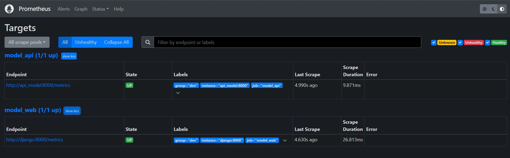
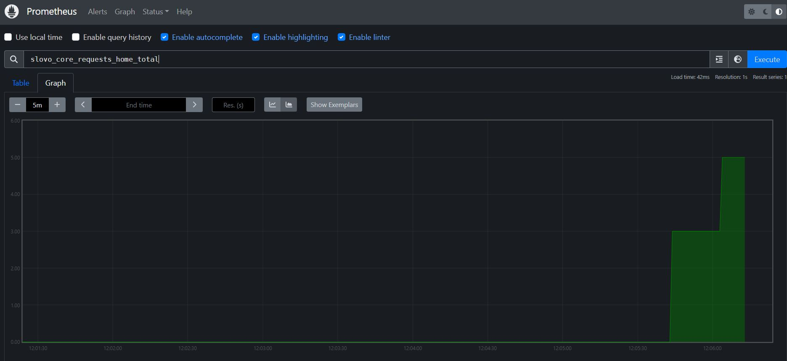
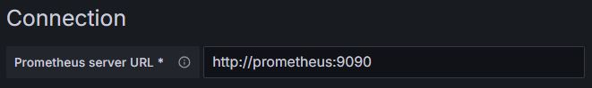
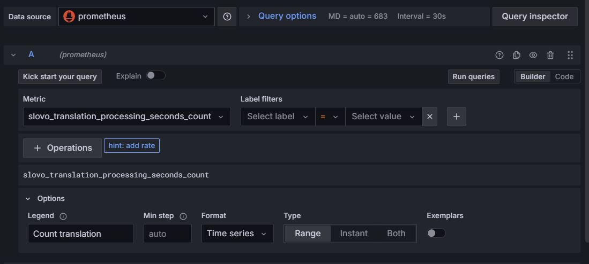
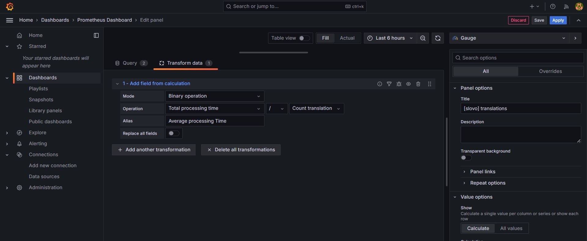
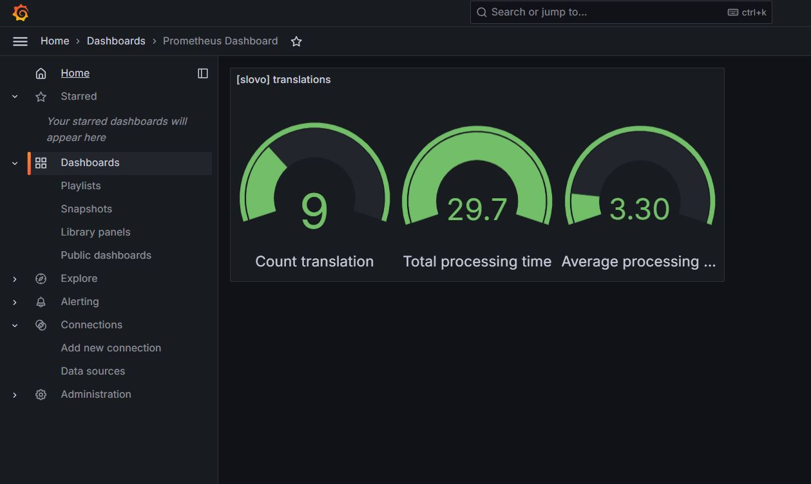

# Procédure d'installation et de configuration de la solution de monitoring

## 1. Lancement des applications 
<b>En local sur une machine avec docker installé : </b>

1. Télécharger le fichier demo/docker-compose.yml du répertoire
2. En gardant le même réseau, configurer les images/volumes <b>des applications utilisées</b> pour correspondre au besoin 
3. Dans le répertoire courant , créer un dossier prometheus
4. C/C les fichiers alert_prometheus.yml et prometheus.yml
5. Modifier les fichiers pour faire correspondre aux besoins ( DNS ...)
6. Créer un fichier .prom_pwd et mettez-y votre mot de passe pour vous authentifier auprès de votre application
7. Lancer les conteneurs avec la commande ```docker compose up -d ```


## 2. Configuration des applications

### 2.1 Prometheus 
1. Vérifier la bonne configuration de Prometheus avec l'application : </br>
</br>

</br>
</br>

2. Les métriques de votre application doivent pour voir être visualisées comme telles : 
</br>
</br>

</br>

### 2.2 Grafana 

documentation officielle : https://grafana.com/docs/grafana-cloud/connect-externally-hosted/existing-datasource/ 
#### 2.2.1 Lier avec Prometheus
1. Barre latérale > Connections > Add new connection 
2. Dans les sources de données disponible, sélectionner "Prometheus"
3. Spécifier les champs nécessaires ( Host, Authentication) , en local et comme grafana et prometheus sont sur le même réseau, on peut écrire en host ( résolution DNS interne) : 
<br><br>
 <br>

#### 2.2.2 Créer un tableau de bord
1. Dashboards > Selectionner le menu déroulant New  > New Dashboard
2. Selectionner "Add visualization"
3. Choisir la source de données correspondante
4. Dans l'onglet "query" , sélectionner les métriques voulues et configurer des alias : <br> <br>
 <br>
5. Dans l'onglet "Transform Data", effectuer des opérations entre les métriques pour exploiter les résultats:
<br><br>
 <br>

<h2>Exemple de résultat : </h2>
<br><br>
 <br>
